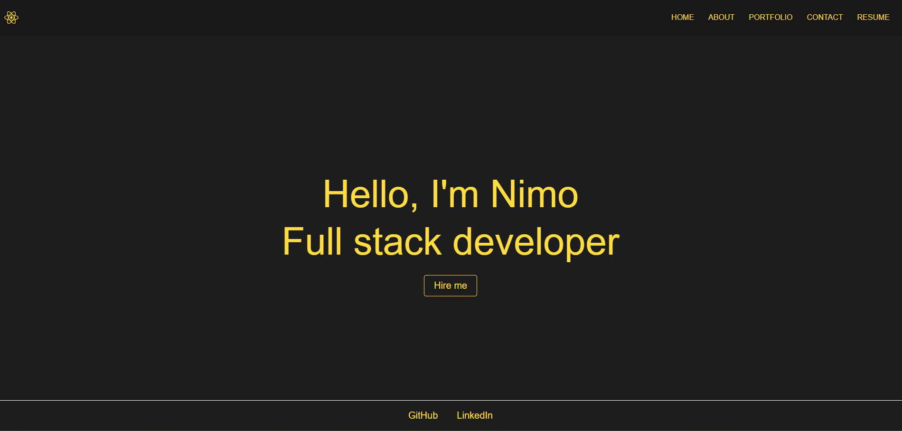

# R-portfolio

The React Portfolio project is a dynamic and visually engaging web application designed to showcase your skills, projects, and professional experiences. Built with the latest version of React, this portfolio provides a clean and modern interface to present your work effectively to potential employers, clients, or collaborators.

## Features

**Responsive Design:** The portfolio is fully responsive, ensuring an optimal viewing experience across a variety of devices, from desktops to mobile phones.

**Project Showcase:** Highlight your key projects with detailed descriptions, images, and links to live demos and source code repositories.

**Skill Visualization:** Display your skills with an intuitive progress bar, providing a visual representation of your proficiency levels.

**Professional Experience:** Outline your work history, including roles, responsibilities, and durations, in a well-structured format.

**Interactive Elements:** Incorporate modern UI elements such as animations, icons, and interactive components to enhance user engagement.

## Technology Stack

**React:** A JavaScript library for building user interfaces, allowing for the creation of reusable components.

**React Router:** For handling navigation within the application, enabling smooth transitions between different sections.

**Sass:** A powerful CSS preprocessor that allows for variables, nested rules, and more, making stylesheets more maintainable and extendable.

## Contributions

Contributions are welcome! If you have suggestions for improvements or new features, feel free to fork the repository and submit a pull request. Ensure that your code follows the project's coding standards and includes appropriate documentation.

# Deployment Ready 

live at  https://nimo20.github.io/R-portfolio/